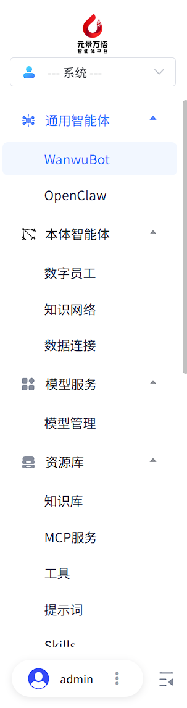
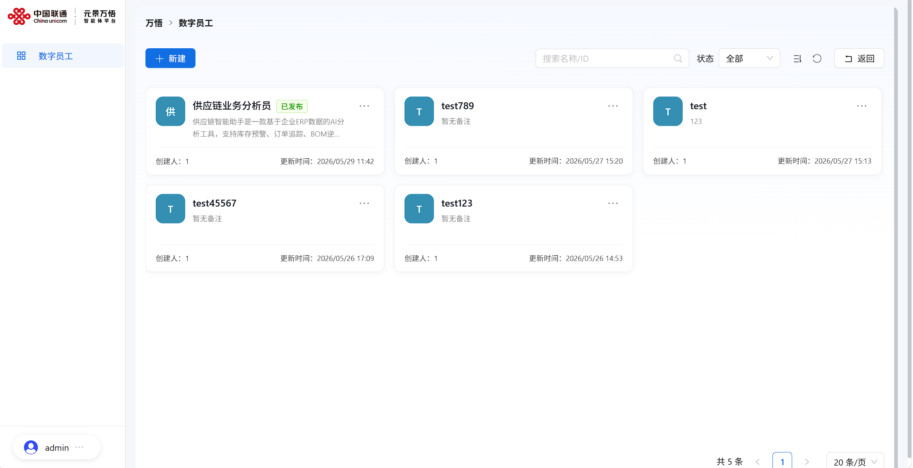
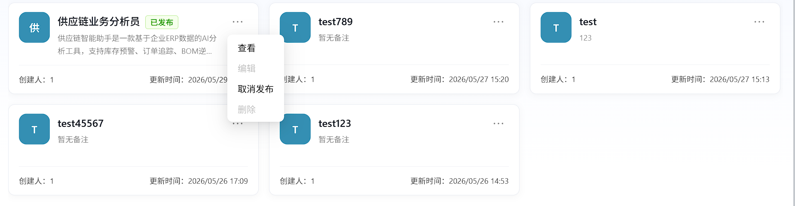
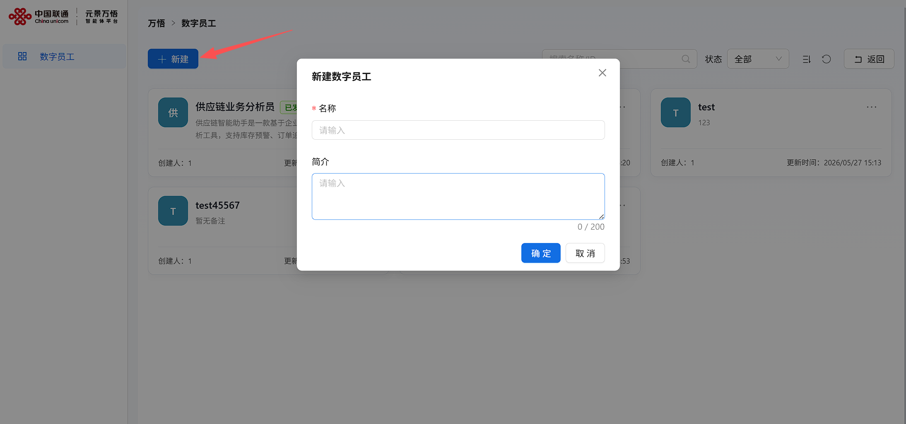
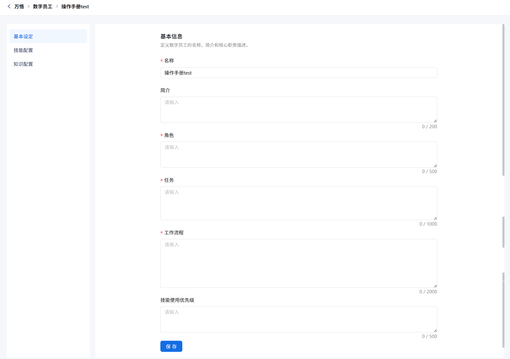
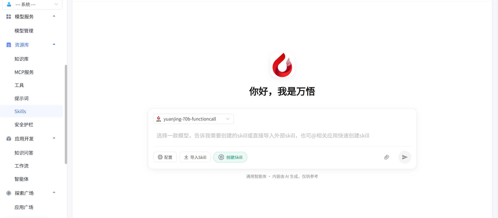
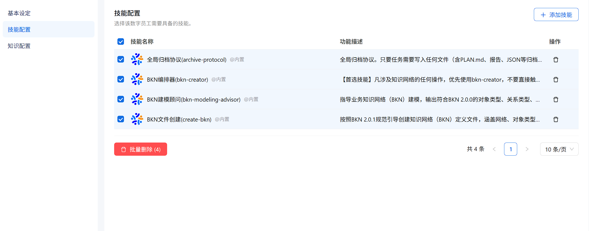
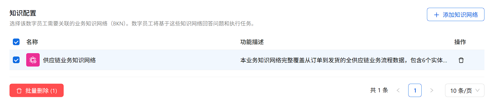
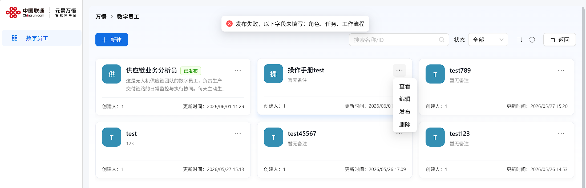
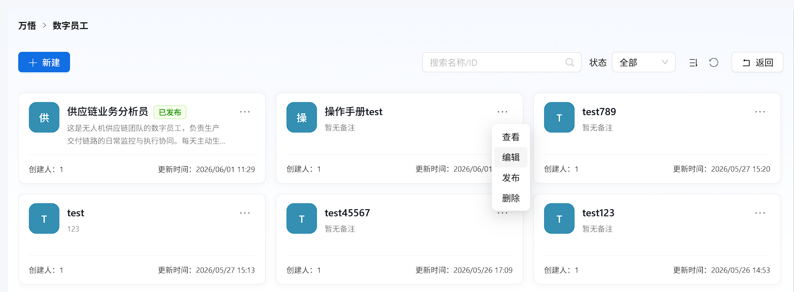

# 数字员工使用教程

## 1. 数字员工概览  

在元景万悟智能体平台左侧导航栏的“本体智能体”分类下，点击进入“数字员工”。

在【数字员工】列表页，可查看当前用户下所有数字员工，支持按名称/ID模糊查询、按草稿或已发布状态筛选，并可按名称或更新时间进行排序。

对于已经发布的数字员工，支持查看和取消发布的功能，对于未发布的数字员工支持查看、编辑、发布、删除功能。

若想修改或删除，需要先取消发布再进行下一步操作。删除后数据无法恢复，请谨慎操作。

## 2.创建数字员工

点击【新建】按钮，在弹出的【新建数字员工】窗口中填写名称和简介，点击【确定】完成数字员工创建。

注：名称具有唯一性，不可重复。

 

在【基本设定】处，完成角色、任务、工作流程及技能使用优先级等信息填写后，点击【保存】。

在【技能配置】处，点击【添加技能】打开技能列表，可选择已有技能进行添加；点击【技能创建/导入】将跳转至资源库的Skill页面进行创建或导入。

在【技能配置】列表中可同时添加多个技能，支持勾选多个技能后批量删除，也可点击单个技能右侧删除图标进行单独删除。

在【知识配置】处，点击【添加知识网络】，在弹窗中选择需要关联的知识网络并点击【添加】，最后点击【确定】完成配置。

注：只可以选择一个知识网络，若知识配置中暂无知识网络，请先去添加知识网络。

添加完成后，可在【知识配置】列表中查看已关联的知识网络，并可勾选后进行删除或批量删除操作。

三个步骤编辑填写成功后，点击保存，完成数字员工的创建。

## 3.发布数字员工

发布数字员工时，应填写【角色】、【任务】、【工作流程】等必填信息后才可以发布。

点击数字员工卡片右上角【…】，选择【编辑】进入编辑页面，补充缺失信息， 后续信息填写与创建数字员工时一致，此处不再赘述。   

补充信息后，点击发布即可发布成功

## 4.删除数字员工

对于已发布的数字员工，需要先取消发布，然后再删除。未发布的数字员工可以直接删除。

