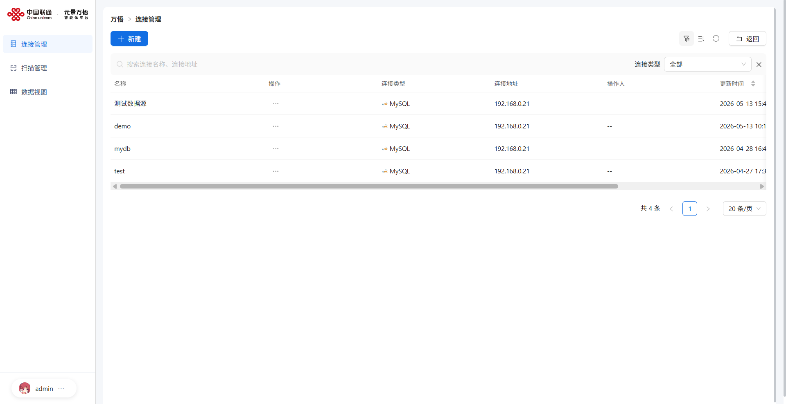
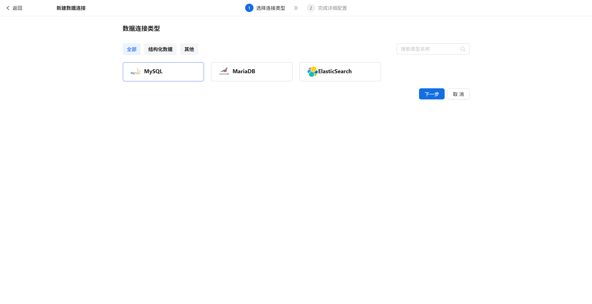
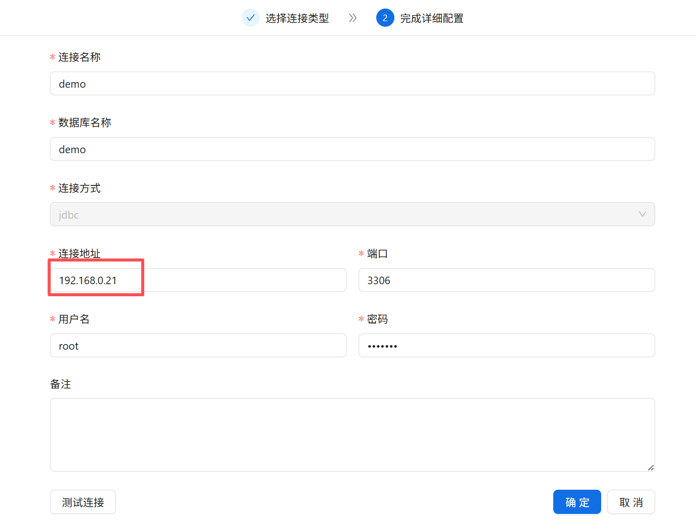
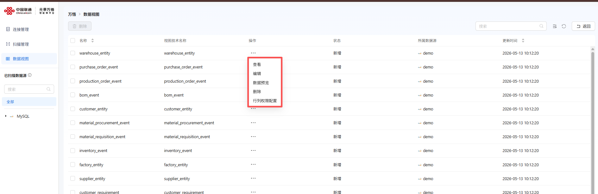
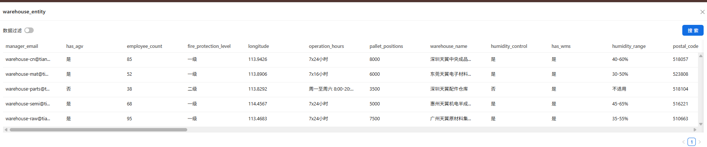
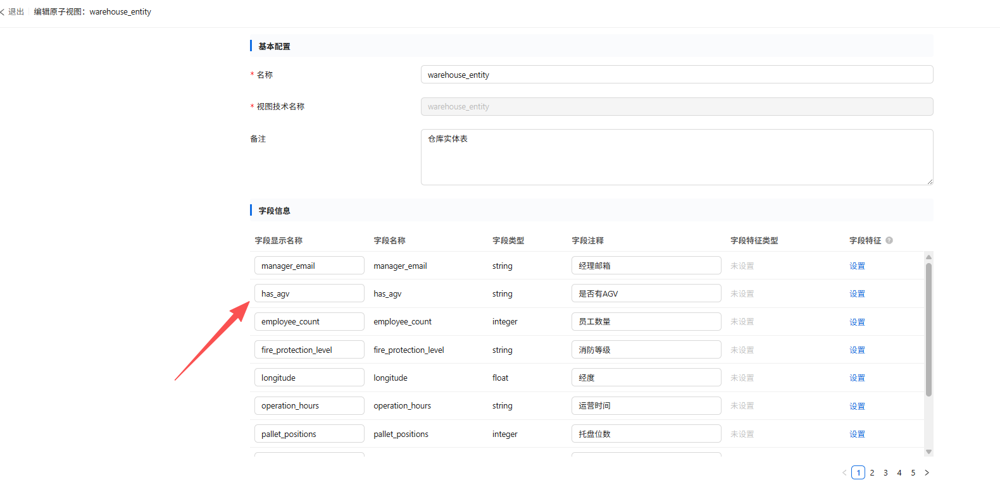

# 连接管理

从万悟平台首页右侧菜单中：【本体智能体】->【数据连接】跳转进入平台界面


## 1.新建数据源连接




操作步骤：

1）在【连接管理】中点击【新建】按钮



2）点击下一步，进入数据连接配置页面：


3）配置完成后，可以点击【测试连接】测试数据源连接是否可用，测试成功后，可点击【确定】保存此数据源配置。


4）系统提供内置示例数据源，地址默认配置为192.168.0.21，需要修改成您服务器的真实IP地址，如密码有变化，需要重新输入密码。



5）默认数据源可以通过docker命令部署，sql脚本（示例文件见网盘：https://pan.baidu.com/s/1g3URlvWp7egFAWsbPCV6rA?pwd=yd68 提取码: yd68）在同目录下的sql目录下，请上传至服务器。docker命令需要和.sql脚本在同一目录下执行。

```bash
docker run -d \
  --name mysql-demo \
  -p 3306:3306 \
  -e MYSQL_ROOT_PASSWORD=root123 \
  -e MYSQL_DEFAULT_AUTHENTICATION_PLUGIN=mysql_native_password \
  -e DEFAULT_AUTHENTICATION_PLUGIN=mysql_native_password \
  -v $(pwd)/00-init-demo-business-data.sql:/docker-entrypoint-initdb.d/init_demo.sql \
  mysql:8.0.37 \
  --character-set-server=utf8mb4 \
  --collation-server=utf8mb4_unicode_ci \
  --default-authentication-plugin=mysql_native_password \
  --skip-character-set-client-handshake
```


## 2.新建扫描任务

新建数据源后，或创建完demo数据源，需要立即创建扫描任务，完成扫描后方可使用。


操作步骤：

1）在【扫描管理】中点击【新建扫描任务】


可选择使用整个数据连接创建，在弹框中选择要扫描的数据源：


如图所示，我们勾选 上面新建的数据源后，点击下一步进行扫描任务配置：


如上图所示：

1. 扫描类型：立即扫描
2. 扫描策略：可选择扫描新增表 或者 仅扫描变更表
3. 启动状态：默认为开启

勾选适合的选项操作后点击【确定】


2）创建完扫描任务后，可以在扫描任务列表中，查看扫描详情信息


## 3.查询数据视图

在【数据视图】中可以查看上面扫描任务完成后的数据库中的表、表结构、数据，如下图所示，可以在操作列中选择：查看\编辑\数据预览\删除等操作



可以选择【数据预览】后，可以查询 数据库中此表的表结构和数据情况,在这里我们可以对数据进行搜索和查询，而无需到数据库执行相关查询操作



同时，点击【编辑】可以对数据视图中的字段名称（逻辑名称）进行修改操作：

