# Skills

### 内置

平台内置丰富Skill，用户可在万悟平台使用，或下载后，在其他平台（如OpenClaw）使用。

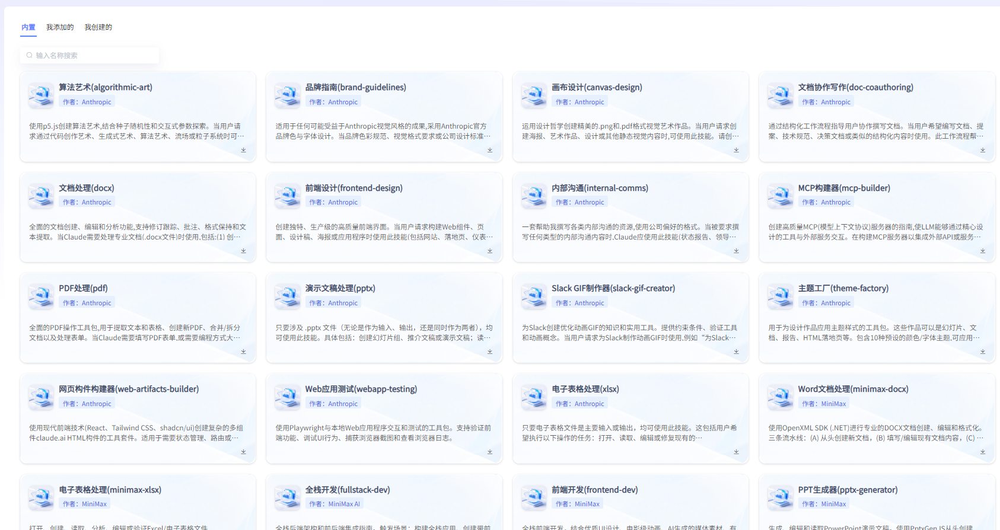

#### 查看详情

点击卡片，可查看skill详情，并支持下载，也支持skill推荐。

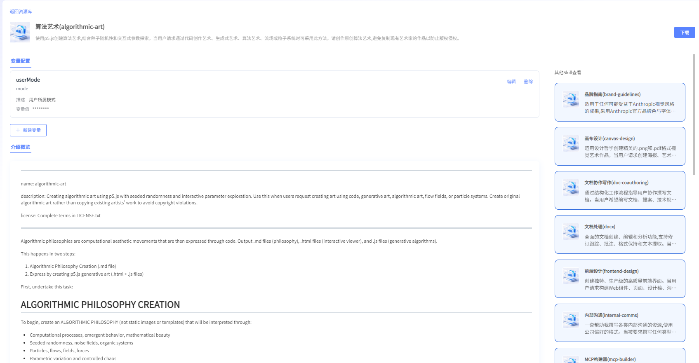

#### 变量配置

若skill的使用，需要进行变量配置，平台支持用户新增自定义变量。配置变量名称、变量名、描述、变量值

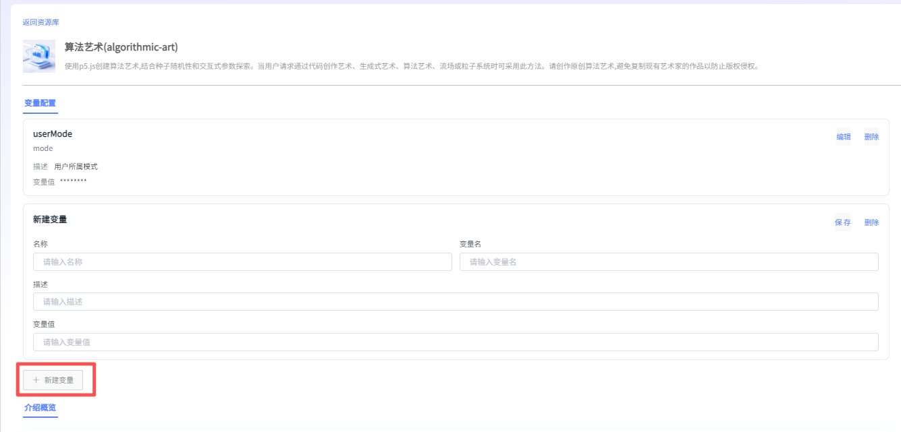

### 我创建的

平台支持用户一句话创建skills，并保存，同时支持下载。保存后的skill可在“我创建的”页面查看详情，并支持在后续应用开发中调用。

#### 1）创建skills

点击“创建自定义skills”，用户可选择一款模型，通过自然语言对话，在平台中创建skill。同时可浏览创建历史。支持从以下2个入口进入Skill创建：

- 资源库-Skills-我创建的
- 通用智能体-WanwuBot-创建Skill

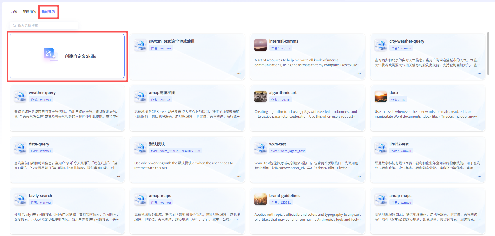

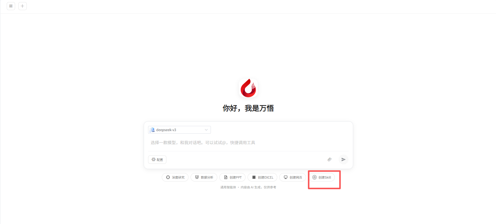

##### a. 自然语言创建

进入后，用户可通过自然语言交互进行Skill开发，或@对应工具直接转化为Skill

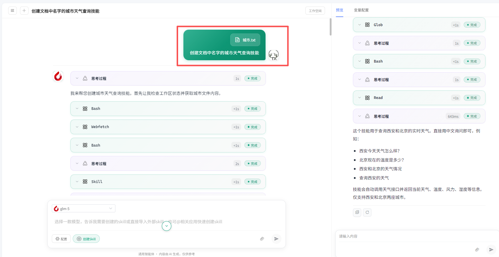

##### b. 导入外部Skill创建

点击【导入Skill】，可上传外部Skill文件

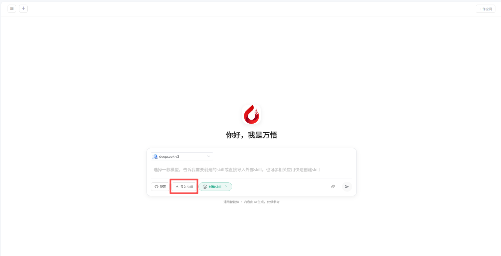

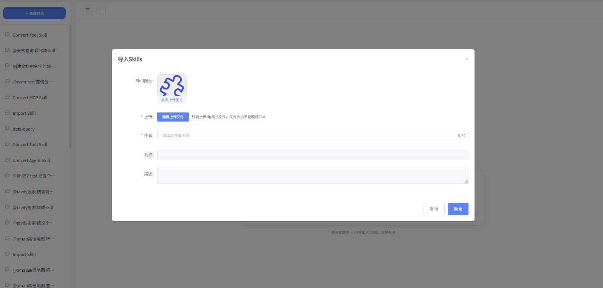

##### c. 平台内工具和应用转化为Skill

支持用户将平台内的MCP、自定义工具、知识问答、工作流、智能体一键转化为Skill。

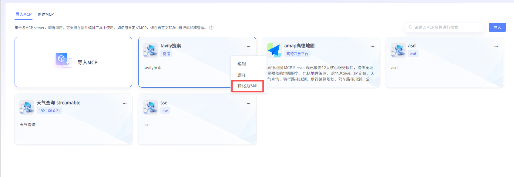

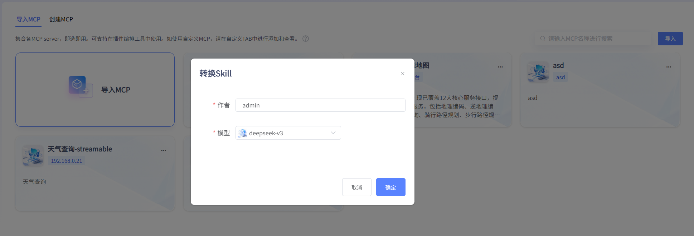

#### 2）预览测试

用户可在预览界面对创建好的Skill进行在线预览测试，交互问答。

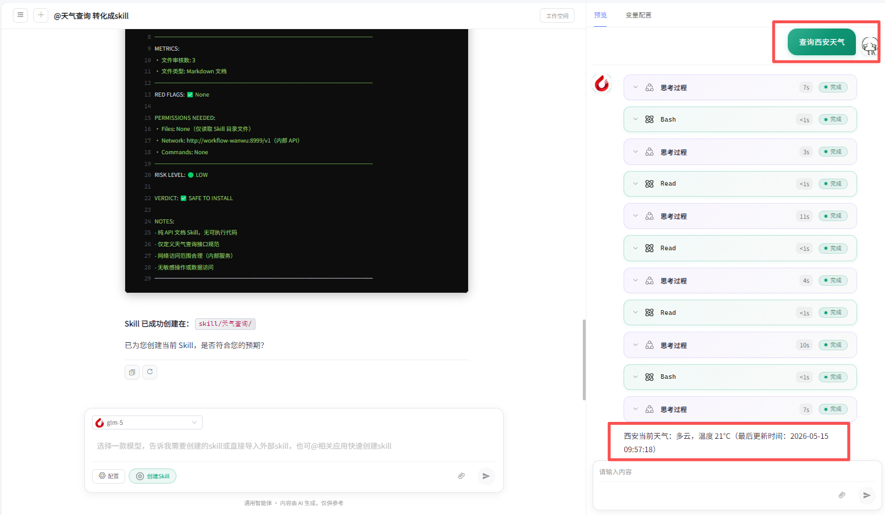

#### 3）变量配置

若skill的使用，需要进行变量配置，平台支持用户新增自定义变量。配置变量名称、变量名、描述、变量值

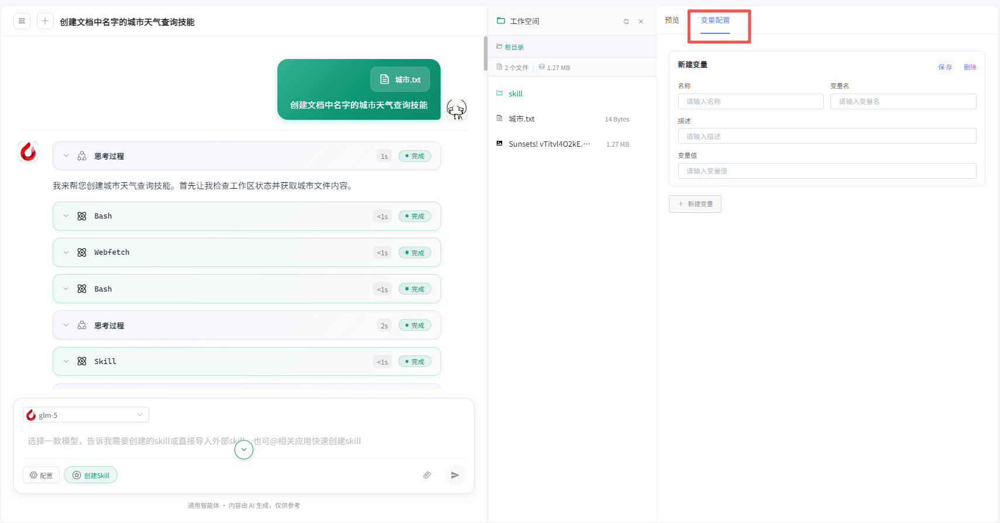

#### 4）工作空间

在工作空间可查看生成的Skill文件，并支持下载。

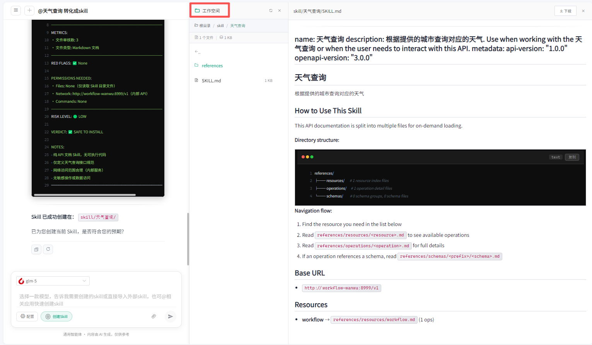
